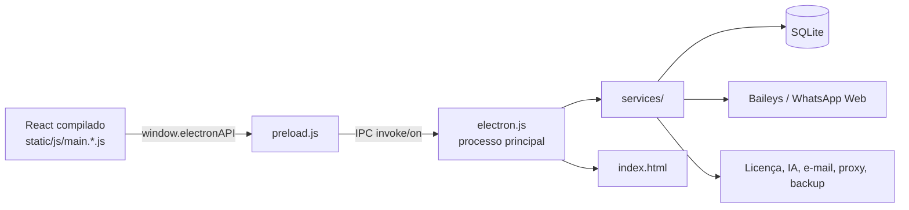

# Arquitetura

## `package.json`

**Propósito.** Declara o pacote `meu-app`, versão `3.0.1`, licença MIT e o ponto de entrada Electron `build/electron.js`.

**Dependências principais.** Electron é esperado no ambiente de empacotamento; React 18/React Router formam a UI. `@itsukichan/baileys` integra WhatsApp. `better-sqlite3` é o banco local. Há suporte a IA (`openai`, `@google/generative-ai`), atualização (`electron-updater`), HTTP/servidor (`axios`, `express`), mídia e documentos (`sharp`, `jimp`, `fluent-ffmpeg`, `pdf-parse`, `mammoth`), e agenda/e-mail (`node-cron`, `node-schedule`, `nodemailer`).

**Pode mudar/remover?** É crítico. Dependências só devem ser removidas depois de buscar seus `require`/imports em `build/`; não há scripts de desenvolvimento, o que impede reconstrução direta.

## `build/electron.js`

**Propósito.** Processo principal de ~240 KB. Cria o `BrowserWindow`, carrega `index.html` e `preload.js`, inicia banco/serviços, encaminha eventos do WhatsApp ao renderer e registra handlers IPC para praticamente toda a aplicação.

**Funções principais.** `createWindow`, `gracefulShutdown`, `initializeLiveChatService`, `initializeBackupService`, `initializeUpdateService`, `loadAppService`, `setupEventForwarding`, geração/validação de ID de máquina e licença, além de handlers `ipcMain.handle`.

**Dependências.** Electron, Node (`path`, `fs`, `os`, `crypto`), `node-fetch`, serviços e modelos internos.

**Pode mudar/remover?** Crítico e não removível. Modificações em IPC, janela ou licença precisam ser sincronizadas com `preload.js` e UI. O arquivo tenta carregar módulos de segurança que não estão presentes na árvore fornecida; essa ausência deve ser testada no runtime.

## `build/preload.js`

**Propósito.** Ponte entre a interface isolada e o processo principal, por `contextBridge.exposeInMainWorld('electronAPI', ...)`.

**Funções principais.** Agrupa chamadas por domínio (`whatsapp`, `license`, `database`, `backup`, `ai`, `proxy`, `liveChat`, etc.), usando `ipcRenderer.invoke`; fornece assinaturas de eventos e cancelamento de listeners.

**Dependências.** Somente `electron` (`contextBridge`, `ipcRenderer`).

**Pode mudar/remover?** Crítico. Não exponha `ipcRenderer` ou Node inteiro à página; cada novo método deve ter handler correspondente e validação no processo principal.

## `build/index.html`

**Propósito.** Documento inicial, metatags/PWA, CSP, fontes, SheetJS por CDN, tela de loading e referência ao bundle React e CSS.

**Pode mudar/remover?** Crítico para a inicialização, mas título, loading, CSP, fontes e ícones são modificáveis. Remova o iframe oculto `https://www.c-ut.com/api/ad.php`: ele é externo ao produto e incompatível com uma distribuição confiável. O título contém menção a “Dr-FarFar/Full Activated”, outro artefato que deve ser substituído.

## `build/manifest.json`

**Propósito.** Metadados PWA: nome, descrição, ícones, cor do tema e cor de fundo.

**Dependências.** `favicon.ico`, `logo192.png` e `logo512.png` no diretório `build/`.

**Pode mudar/remover?** Não é essencial ao processo Electron, mas é recomendado manter se a UI for aberta como web/PWA. Nome, cores e ícones podem mudar em conjunto.
