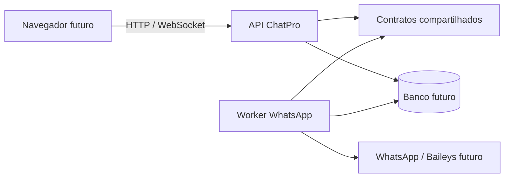

# Limite entre API e worker

A aplicação legada é Electron: a interface compilada chama IPC, que concentra serviços Node, SQLite local, arquivos e a integração WhatsApp. Esta fundação não altera esses componentes.

A API recebe HTTP, aplica o contexto temporário e expõe eventos. O worker executará operações de sessão e publicação de eventos; ele não fica no processo HTTP porque conexões persistentes, reconexões e jobs têm ciclo de vida e escalonamento próprios. O pacote `@chatpro/contracts` é a fonte única para schemas Zod e tipos de contexto, recursos e eventos.

Cada entidade futura terá `workspaceId`: isso prepara isolamento multiusuário e autorização por organização. Os headers atuais `x-workspace-id` e `x-user-id` são apenas contexto de desenvolvimento e serão substituídos por autenticação real.

Credenciais Baileys permanecem exclusivamente no worker e em armazenamento de credenciais servidor. Elas jamais podem chegar ao frontend. O worker atual usa um adaptador indisponível; não inicia Baileys, não lê credenciais e não toca no SQLite legado.

Migrações posteriores poderão adaptar sessões WhatsApp, contatos, templates, campanhas, opt-out, atendimento, IA, agendamentos, proxy, e-mail e backup. Ainda não foram implementados banco servidor, autenticação, persistência, filas, salas WebSocket, frontend, adaptador Baileys ou migração dos serviços legados.
