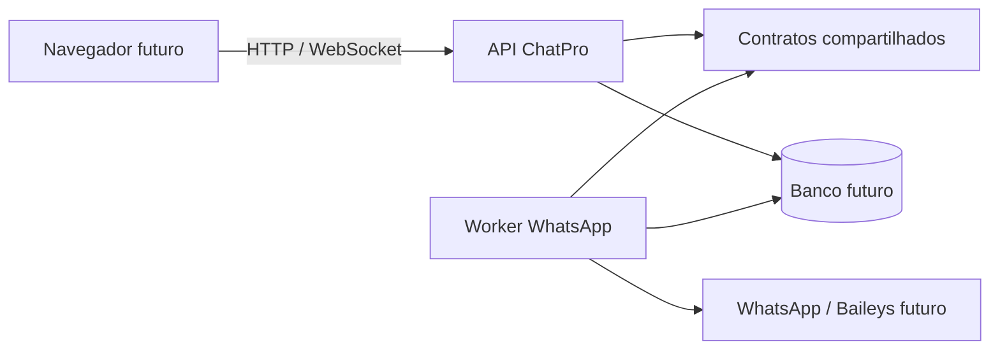

# Limite entre API e worker

## Sessoes HTTP ativadas (15/07/2026)

As rotas tecnicas `/api/v1/sessions` (list/create), `/status`, `/qr`, `/connect`, `/stop`, `/logout` e `DELETE` usam somente o transporte HTTP loopback. Os comandos internos sao `session.list`, `session.create`, `session.connect`, `session.status`, `session.qr`, `session.stop`, `session.logout` e `session.remove`.

A API encaminha somente `workspaceId` e `correlationId`; regras, credenciais e QR ficam no worker. Os estados publicos sao `disconnected`, `connecting`, `waiting_qr`, `connected`, `stopped` e `error`. O QR fica apenas em memoria ate expirar/conectar/parar/logout/remover. Nao ha login/autenticacao ChatPro nesta fase.

## Transporte interno (15/07/2026)

API e worker sao processos separados e usam HTTP interno em `127.0.0.1` (`POST /internal/transport`), nunca exposto publicamente. `@chatpro/contracts` define comando, resposta/erro, evento, `correlationId`, `workspaceId` e timeout. A API usa `InternalWorkerClient`; o worker usa `internal-transport-server` e o fecha antes do shutdown do gerenciador.

O fluxo e API -> comando validado -> worker -> resposta com o mesmo `correlationId` e `workspaceId`. O timeout padrao e 2 s (`WORKER_TRANSPORT_TIMEOUT_MS`, maximo 30 s); timeout e indisponibilidade retornam erro tipado e o servidor impede resposta duplicada. `transport.ping` permanece para diagnostico; os comandos de sessao sao encaminhados somente pelo loopback.

Nao ha autenticacao de usuario nesta fase; `workspaceId` e somente o limite preparatorio de isolamento. Login, licenca, pagamentos e Supabase nao fazem parte desta integracao. Operacoes reais de sessao/QR e entrega de eventos a API continuam fora de escopo.

A aplicação legada é Electron: a interface compilada chama IPC, que concentra serviços Node, SQLite local, arquivos e a integração WhatsApp. Esta fundação não altera esses componentes.

A API recebe HTTP, aplica o contexto temporário e expõe eventos. O worker executará operações de sessão e publicação de eventos; ele não fica no processo HTTP porque conexões persistentes, reconexões e jobs têm ciclo de vida e escalonamento próprios. O pacote `@chatpro/contracts` é a fonte única para schemas Zod e tipos de contexto, recursos e eventos.

Cada entidade futura terá `workspaceId`: isso prepara isolamento multiusuário e autorização por organização. Os headers atuais `x-workspace-id` e `x-user-id` são apenas contexto de desenvolvimento e serão substituídos por autenticação real.

Credenciais Baileys permanecem exclusivamente no worker e em armazenamento de credenciais servidor. Elas jamais podem chegar ao frontend. O worker atual usa um adaptador indisponível; não inicia Baileys, não lê credenciais e não toca no SQLite legado.

Migrações posteriores poderão adaptar sessões WhatsApp, contatos, templates, campanhas, opt-out, atendimento, IA, agendamentos, proxy, e-mail e backup. Ainda não foram implementados banco servidor, autenticação, persistência, filas, salas WebSocket, frontend, adaptador Baileys ou migração dos serviços legados.
